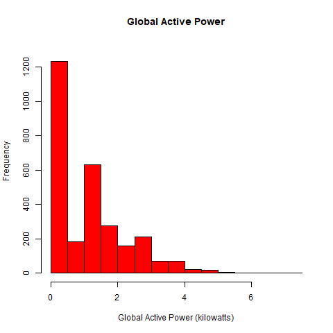
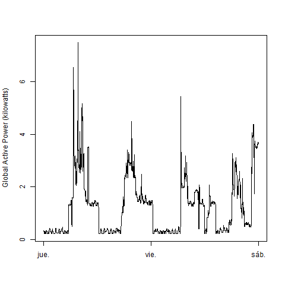
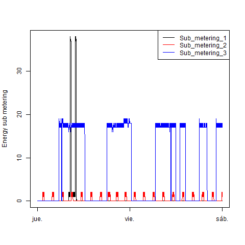
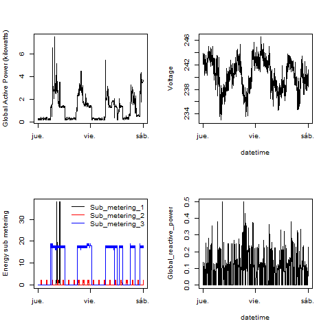

#### Exploratory Data Analysis: Course Project 1 ####

Here you can see the 4 constructed plots. Separated png files were added to this repository along with one script for each plot. Since I'm originally from a spanish speaking country, my computer system put the dates in spanish:

* Jue. = Jueves (spanish) = Thursday
* Vie. = Viernes (spanish) = Friday
* Sab. = Sábado (spanish) = Saturday

### Plot 1

 

### Plot 2

 

### Plot 3

 

### Plot 4

 

